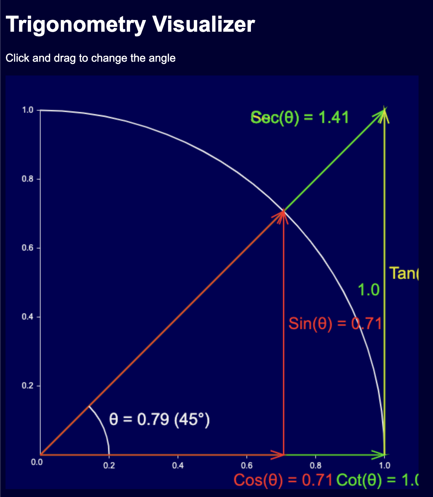
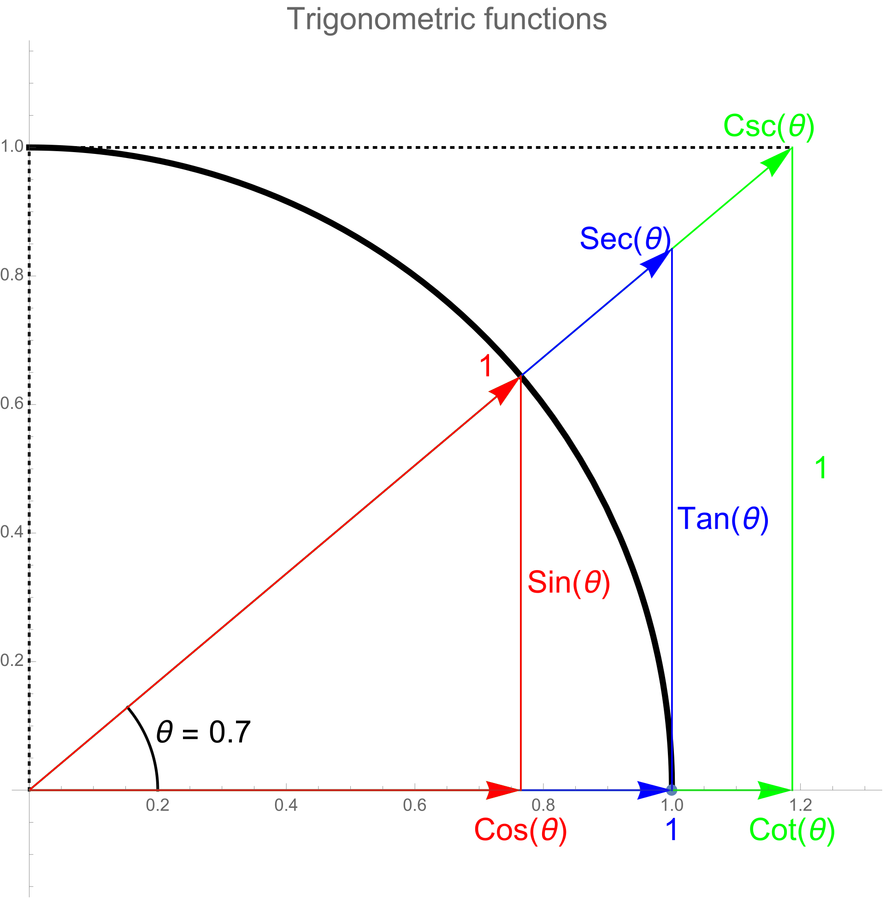

# trigonometry-visualizer
An interactive canvas visualizing 6 trigonometric functions

## Sample:

The following image is the source of the inspiration
[Wikipedia](https://en.wikipedia.org/wiki/Trigonometric_functions)

